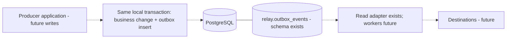

[Português brasileiro](../pt-BR/architecture.md) | [README](../../README.md)

# Architecture

## Implemented foundation

`main` → configuration and telemetry → TCP listener → application HTTP lifecycle.
The application accepts an injected shutdown future, so lifecycle tests use a real ephemeral socket without global signal state. It has no delivery or storage logic. The event domain lives in `src/domain/event.rs`; focused persistence interfaces now exist separately; no runtime adapter or broker abstraction is connected.

## Canonical event envelope — Milestone 1.1 implemented

`domain::event::EventEnvelope` defines the transport/storage boundary, with private fields and read accessors:

| Field | Rust representation | Meaning |
| --- | --- | --- |
| `id` | `Uuid` | Stable event identity, generated as UUID v7 |
| `event_type` | `EventType` | Validated string, independent of business event catalogs |
| `aggregate_type` | `String` | Generic originating aggregate type |
| `aggregate_id` | `String` | Generic identifier; UUID, integer, ULID or external formats are acceptable |
| `schema_version` | `NonZeroU32` | Positive schema version, starting at 1 |
| `occurred_at` | `DateTime<Utc>` | Business occurrence time in UTC, serialized as RFC 3339 |
| `correlation_id` | `Option<Uuid>` | Links related operations/events |
| `causation_id` | `Option<Uuid>` | Identifies the event or command that caused this event |
| `payload` | `serde_json::Value` | Event-specific JSON |

`EventEnvelope::new(event_type, aggregate_type, aggregate_id, schema_version, payload)` returns a typed `EventError` on invalid input and generates the ID and current UTC time. Optional metadata starts absent; `with_correlation_id` and `with_causation_id` add it. Empty or whitespace-only event types, aggregate types and aggregate IDs are rejected; nonempty strings are preserved without format or length restrictions. Schema version zero is rejected. `EventType` provides its own validated constructor.

Serde restoration preserves the original identity and occurrence time and applies the same validation. This is also the way to supply historical or deterministic timestamps; offsets are normalized to UTC. JSON has the nine field names above, with absent metadata serialized as `null`. IDs remain stable across serialization and restoration. UUID v7 provides time-ordering characteristics, not strict global ordering. Schema versions describe payload evolution; there is no migration or compatibility framework. JSON is the transport/storage payload boundary, not a requirement to use untyped JSON in internal business logic.

Dependencies are Serde (derive), serde_json, UUID (v7/serde), and Chrono (clock/serde, default features disabled). The small error enum uses the standard library rather than adding thiserror. There is no persistence or delivery behavior.

## Envelope decisions and trade-offs

UUID v7 supplies globally unique event identity with useful temporal characteristics, not strict global ordering. Aggregate strings support upstream UUIDs, integers, ULIDs, external IDs and other formats, at the cost of weaker format guarantees. EventType validates nonempty logical names without a business-specific enum; naming consistency remains the producer's responsibility. NonZeroU32 prevents zero versions but cannot establish schema compatibility. DateTime<Utc> standardizes RFC 3339 timestamps; clock accuracy and business occurrence meaning remain producer responsibilities.

JSON provides a flexible transport/storage boundary while sacrificing compile-time payload typing; business code should still prefer typed structures where appropriate. Optional UUID correlation and causation IDs are simple and consistent with relay IDs, but cannot directly represent string trace IDs, ULIDs, vendor identifiers or arbitrary correlation tokens. This is an explicit current trade-off and future review point based on integration evidence; the envelope implementation is unchanged in Milestone 1.2.

## Local PostgreSQL infrastructure — Milestone 1.2 implemented

Compose provides PostgreSQL with health-gated workspace startup, container access at postgres:5432, loopback host access at 127.0.0.1:5433 and physical `.dockerized-postgres/` storage. SQLx tooling constructs DATABASE_URL; the Rust binary still establishes no database connection. Docker readiness is distinct from application readiness. See [topology/setup](docker-and-configuration.md), [PostgreSQL decision](postgresql.md) and [ADR 002](adr/002-use-postgresql-for-durable-event-storage.md). SQLx CLI handles explicit migrations; outbox writes and processing remain future work.

## Intended evolution (not implemented)

```text
Producer / Application
        |
        v
   PostgreSQL
 Transactional Outbox
        |
        v
 Reliable Event Relay
        |
        +------> RabbitMQ
        |
        +------> HTTP Webhook
        |
        +------> Redis Streams
```

A producer could atomically write its business change and outbox event in the same database transaction. Relay workers would claim persisted events and publish to destinations. This is conceptual direction, not current functionality.

## Engineering questions and expected direction

- Crash survival: durable event records and recoverable claims must replace process-only state. Crash windows before and after publication need explicit tests.
- Publication succeeds, state update fails: the relay cannot safely infer whether the remote side acted. Retrying can duplicate the event.
- At-least-once: retrying unacknowledged delivery creates duplicates. Consumers need stable event IDs, deduplication and atomic application of effects with their idempotency record.
- Retries: distinguish transient and permanent failures, use bounded exponential backoff with jitter, timeouts and attempt limits. Values require evidence; none are configured today.
- Poison messages: isolate exhausted or invalid events in a dead-letter state with diagnostic context and deliberate replay.
- Memory: bounded queues and finite worker concurrency cap in-memory work; durable backlog still requires retention and capacity planning.
- Faster producers: pause claims, limit admissions or shed load deliberately; queue growth cannot be solved by unbounded memory. Define backpressure at each boundary.
- Ordering: concurrent delivery and retries can reorder events. Per-key sequencing may be practical, at the cost of parallelism and head-of-line blocking. No global ordering is currently promised.

## Trade-offs and non-goals

Future delivery initially targets at-least-once semantics, not exactly-once delivery. Exactly-once effects generally require cooperation and idempotency across system boundaries. No atomic transaction spanning PostgreSQL and every destination is promised. Current health does not prove durable storage, broker connectivity or readiness. Production operations, multi-region consensus, unlimited throughput, global ordering and loss-free in-memory queues are not initial goals. An HTTP scaffold provides a testable lifecycle at the cost of a small server dependency; it is not evidence of relay reliability.

## Provisional roadmap

| Milestone | Exploration |
| --- | --- |
| 0 — Foundation | Rust, Docker, configuration, tracing, shutdown, health, tests, bilingual docs (implemented) |
| 1 — Durable event model | **Closed: 1.1-1.8 implemented and validated within their documented scope**; see [closure review](milestone-1-review.md) |
| 2 — First delivery adapter | RabbitMQ publisher, delivery state, retries, at-least-once semantics |
| 3 — Reliability | Exponential backoff, DLQ, idempotency, crash recovery, poison messages |
| 4 — Concurrency | Bounded channels, worker pools, concurrency limits, backpressure, graceful draining |
| 5 — Multiple destinations | HTTP webhooks, Redis Streams, routing abstraction |
| 6 — Observability | Prometheus, readiness, delivery latency, retry counters, backlog depth |
| 7 — Failure scenarios and benchmarks | Broker outage, worker crash, timeouts, backlog recovery, throughput and latency measurements, documented limits |

These are study milestones, not promised releases. Architecture may change when implementation evidence suggests a better design.

## Milestone 1 progress (closed)

- [x] 1.1 Canonical Event Envelope
- [x] 1.2 Local PostgreSQL in Docker
- [x] 1.3 Migration Infrastructure
- [x] 1.4 Outbox schema
- [x] 1.5 Persistence abstraction
- [x] 1.6 PostgreSQL repository
- [x] 1.7 Integration tests
- [x] 1.8 Failure and transaction semantics

## Migration infrastructure — Milestone 1.3 completed

SQLx CLI 0.8.6 handles Docker migrations; SQLx 0.8.6 separately backs application reads. The initial migration creates the `relay` namespace; Milestone 1.4 adds the outbox table through a new migration. SQLx 0.8.6 is now an application dependency for the read adapter. [Migration workflow](database-migrations.md) and [ADR 003](adr/003-use-versioned-sql-migrations.md) define ownership and rollback limits. Milestone 1 is closed; PostgreSQL reading is implemented; processing remains planned.

## Outbox schema — Milestone 1.4 completed

`relay.outbox_events` maps the unchanged canonical envelope to UUID/TEXT/BIGINT/TIMESTAMPTZ/JSONB with nullable UUID metadata, plus minimal lifecycle fields. NonZeroU32 needs bounded BIGINT to preserve its full range. The schema exists; Rust writes, producer business transactions, claims and delivery do not. See [columns/invariants/trade-offs](outbox-schema.md) and [ADR 004](adr/004-use-postgresql-transactional-outbox-schema.md).



The producer writes durable outbox events with its own business change in one database transaction; the relay later delivers those durable events. Conceptually: BEGIN → update business state → insert relay.outbox_events (...) → COMMIT. A separate database or remote broker is outside this atomic boundary. At-least-once delivery and idempotency remain future concerns; the table alone does not guarantee exactly-once effects.

## Persistence abstraction — Milestone 1.5 completed

The application-facing `OutboxReader` contract observes eligible pending snapshots using an explicit UTC cutoff and positive BatchSize. PendingOutboxEvent wraps the unchanged envelope plus unsigned attempt count and UTC availability. It is a pending view, not a SQL row or claim. Classified errors retain diagnostic sources with sanitized formatting. Native Send futures and generic dispatch add no dependencies. Runtime remains HTTP-only.

```mermaid
flowchart LR
    APP[Future relay application logic]
    PORT[Persistence contracts and models]
    PG[PostgreSQL adapter - 1.6]
    DB[(relay.outbox_events)]
    APP -->|depends on| PORT
    PG -->|implements; depends inward| PORT
    PG -->|storage access| DB
```



Logic/adapter arrows to PORT mean compile-time dependency, not a runtime call sequence. Generic future callers invoke an implementation through that port; no PostgreSQL types flow inward. Producer writing remains with the producer's business transaction, not an independently committing relay append API. Snapshots are not claims: lifecycle mutation/ownership/recovery APIs are deferred, and no concurrent delivery safety or exactly-once behavior is asserted. The producer/relay handoff diagram above remains conceptual for writes and delivery.

See [full contracts and open questions](persistence-abstraction.md), [ADR 005](adr/005-separate-persistence-contracts-from-postgresql.md) and [test coverage](testing.md). Milestone 1 is closed, including 1.8 [failure/transaction semantics](failure-and-transaction-semantics.md).

## PostgreSQL repository — Milestone 1.6 implemented

`src/infrastructure/postgres/` implements the existing `OutboxReader` using an injected `PgPool`. Infrastructure depends inward on persistence and domain; SQL, SQLx, private rows and driver mapping stay in infrastructure. Models own validation/conversion and contain no queries. No duplicate interface, empty layers, new migration or ADR is needed under ADR 005. Native Send futures/static dispatch remain intact. HTTP startup remains independent of PostgreSQL.

See [query, restoration, bounds and errors](postgres-repository.md), [integration test guidance](testing.md) and [executed validation](validation-results.md). SQLx is now an application dependency as well as separate migration tooling. Writes, claims and processing remain deferred; Milestones 1.7 and 1.8 are complete: integration evidence and [failure/transaction semantics](failure-and-transaction-semantics.md). Milestone 1 is closed; later delivery work has not begun.
