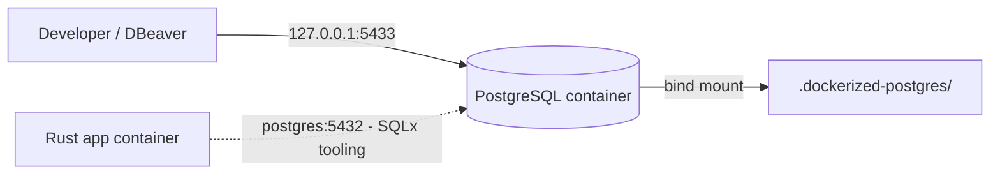

[Português brasileiro](../pt-BR/docker-and-configuration.md) | [README](../../README.md)

# Docker and configuration

The Dockerfile is a development toolchain image, not a production deployment. It pins stable Rust 1.95.0 on Debian Bookworm, includes Bash, rustfmt, Clippy, Python 3 and SQLx CLI 0.8.6, and runs as `developer`. The version tag is pinned; the base image digest is not, so upstream image revisions may still change system packages. Compose uses an init process and a source bind mount. `sleep infinity` keeps the workspace usable even before dependencies have been downloaded.

```bash
cp .env.example .env
# On Linux: set LOCAL_UID=$(id -u) and LOCAL_GID=$(id -g) values in .env.
docker compose up -d --build
docker compose exec app bash
# Inside the shell:
cargo fetch --locked
cargo build --locked
cargo test --locked
cargo fmt
cargo clippy --locked --all-targets --all-features -- -D warnings
cargo run --locked
```

Use Ctrl-C to stop the foreground application and `docker compose down` to stop the development environment. Changes to source need a new run; changes to UID/GID or Dockerfile need image rebuild. On Linux the mount root must be writable by the configured UID/GID. Do not run initial Cargo commands as root. Numeric IDs default to 1000; choose a non-root ID. Existing IDs in the base image may cause user/group creation to fail: choose compatible IDs or adapt the user creation for your environment. Docker Desktop translates macOS/Windows mounts differently; Linux ownership behavior has not been tested on those systems. Windows contributors should use a shell supporting the documented commands (e.g. WSL). Bash is available via `docker compose exec app bash`.

| Variable | Default | Use |
| --- | --- | --- |
| APP_ENV | development | Label in startup logs; does not change delivery behavior |
| RUST_LOG | info | tracing filter, invalid filters fail startup |
| HTTP_ADDR | 0.0.0.0:8080 | IP and port; invalid socket addresses fail startup |
| HOST_HTTP_PORT | 8080 | Compose host loopback port |
| LOCAL_UID / LOCAL_GID | 1000 / 1000 | Build-time developer identity |
| CARGO_HOME | /app/.cargo-cache | Container Cargo source/download cache |
| CARGO_TARGET_DIR | /app/target | Container compiled artifacts |

The first three are application settings. The remaining settings belong to development tooling. There are no mandatory connection strings. The SQLx wrapper constructs DATABASE_URL from Compose-injected PostgreSQL settings; the Rust binary does not consume it. RabbitMQ/Redis URLs, worker concurrency, retry and batch settings remain planned.

The binary loads `.env` from its working directory or ancestors with dotenvy; already-set process variables win. Compose separately reads root `.env` for interpolation (ports/build IDs); it does not inject all values into the container. The source mount exposes `.env` for the binary to load at runtime. To override explicitly: `docker compose exec -e RUST_LOG=debug app cargo run --locked`. An absent `.env` is valid; malformed `.env`, empty APP_ENV, invalid HTTP_ADDR or RUST_LOG, and occupied sockets cause failure.

Keep `.env` and cache credentials out of Git and Docker build context. Do not place secrets in `.env.example`. The port is published on host loopback only; changing HTTP_ADDR to container loopback prevents host access. Keep port 8080 in the container or adjust the Compose container port as well. `/health` is liveness only, with no readiness dependency checks.

## Reconstructing the local environment

```bash
git clone https://github.com/juniocr26/rust-event-relay.git
cd rust-event-relay
cp .env.example .env
# Linux: align LOCAL_UID and LOCAL_GID before building.
docker compose up -d --build --wait --wait-timeout 120
docker compose ps
docker compose logs postgres
docker compose exec postgres sh -c 'pg_isready -h 127.0.0.1 -p 5432 -U "$POSTGRES_USER" -d "$POSTGRES_DB"'
docker compose exec postgres sh -c 'PGPASSWORD="$POSTGRES_PASSWORD" psql -h postgres -p 5432 -U "$POSTGRES_USER" -d "$POSTGRES_DB" -c "SELECT 1;"'
docker compose exec app sqlx migrate run
docker compose exec app cargo fetch --locked
docker compose exec app cargo build --locked
docker compose exec app cargo run --locked
```

Compose creates a project network. `app` resolves `postgres` through Docker DNS. PostgreSQL listens internally on 5432; only the host mapping uses 5433 to avoid the other project's 5432. `app` waits for PostgreSQL's healthcheck without fixed sleeps. The workspace runs `sleep infinity` until you invoke Cargo; the application itself still needs no database connection. The startup dependency is not runtime application readiness.



## Database configuration and clients

| Variable | Example-only default | Use |
| --- | --- | --- |
| POSTGRES_DB | reliable_event_relay | Database initialized in an empty cluster |
| POSTGRES_USER | change_me | Initial superuser |
| POSTGRES_PASSWORD | change_me | Initial local-only password placeholder |
| POSTGRES_HOST | postgres | Docker-internal hostname |
| POSTGRES_PORT | 5432 | Docker-internal port |
| POSTGRES_HOST_PORT | 5433 | Host loopback publication |

Set local credentials in ignored `.env` before first initialization. Compose injects DB/USER/PASSWORD into postgres and all five internal connection components into app. SQLx's Python wrapper percent-encodes user/password/database and constructs DATABASE_URL per invocation. No manual encoding or host Cargo is needed. The URL is passed to SQLx's process, not printed or stored in source. A host DATABASE_URL does not override this wrapper. Ordinary commands use postgres:5432; an explicit SQLx `--database-url` option overrides its connection as upstream CLI behavior, so use that option only deliberately. The Rust binary remains database-independent.

POSTGRES_DB/USER/PASSWORD are primarily initialization variables: **Docker environment != already-created PostgreSQL roles/database state**. For example, changing first_user to second_user in `.env` changes the environment but leaves first_user in a persisted cluster. Authentication can fail even with a healthy server. Changing .env does not rename roles, reset passwords or create a new database in an existing cluster. See the [full explanation and recovery options](postgresql.md#initialization-and-deliberate-reset).

DBeaver uses **127.0.0.1**, port **5433**, database/user/password from POSTGRES_DB/USER/PASSWORD, matching actual initialized state. IPv4 explicitly avoids localhost IPv6 ambiguity. Host clients use 127.0.0.1:5433; containers use postgres:5432. PostgreSQL stays bound to loopback, never 0.0.0.0.

```bash
# Variables expand inside the container, not the host shell:
docker compose exec postgres sh -c 'psql -U "$POSTGRES_USER" -d "$POSTGRES_DB"'
# Host psql: supply configured database/user, then enter password when prompted:
psql -h 127.0.0.1 -p 5433 -U change_me -d reliable_event_relay -W
```

The host values above are placeholders. Direct `docker compose exec postgres psql -U "$POSTGRES_USER"` expands variables in the host shell; single-quoted `sh -c` uses the container environment. Local socket access does not necessarily validate passwords; use authenticated TCP queries from [testing](testing.md).

## Physical state and shutdown

| Host directory | Contents | Ownership |
| --- | --- | --- |
| `.cargo-cache/` | Downloaded Cargo dependencies | Generated/ignored; reconstruct with cargo fetch --locked |
| `target/` | Rust build artifacts | Generated/ignored; reconstruct with cargo build --locked |
| `.dockerized-postgres/` | PostgreSQL cluster data under 18/docker/ | Local/ignored; contains persistent database state |
| `migrations/` | Database schema SQL history | Source-controlled; must be committed |

The first three are generated/local state; migrations are source code. PostgreSQL data is not reconstructable merely by compiling code. Up, down, build and container recreation preserve the cluster; no entrypoint silently resets it. Migration history is never stored inside the data directory. SQLx CLI runs explicit commands, not automatic startup changes. DBeaver edits do not replace migration files as schema authority.

## Deliberate destructive reset

**WARNING: this permanently deletes the local PostgreSQL database state.** Back up anything needed and explicitly decide to discard the cluster before running these manual commands from the repository root. No automated deletion helper is provided.

```bash
docker compose down
rm -rf .dockerized-postgres/
docker compose up -d --build --wait --wait-timeout 120
docker compose exec app sqlx migrate run
```

Reset initializes new roles/database from current .env and deletes all previous databases and data. **Database reset != migration rollback**: `docker compose exec app sqlx migrate revert` executes the last controlled down migration, preserving other cluster state. It does not reset credentials.

## PostgreSQL troubleshooting

- Check `docker compose ps` and `docker compose logs postgres`; pg_isready checks acceptance, not authentication.
- Credentials changed after initialization: use existing authorized credentials, deliberate SQL administration, or the explicitly destructive reset above. Never delete data to silently repair startup.
- Host 5433 occupied: change POSTGRES_HOST_PORT; keep internal 5432.
- Mount permissions/read-only sharing can prevent initialization. Do not make database files world-writable. Linux postgres ownership differs from LOCAL_UID/GID.
- Major-version incompatibility requires supported upgrade or backup/restore, not automatic deletion.
- Compose gates app startup on health; later migration connection failures still fail clearly. Rust tests remain database-independent.

See [PostgreSQL](postgresql.md), [migrations](database-migrations.md), [testing](testing.md) and [validation results](validation-results.md).

## Read-only authentication diagnostics

```bash
./scripts/check-postgres.sh
docker compose exec -T app sqlx migrate info
```

[check-postgres.sh](../../scripts/check-postgres.sh) checks health, IPv4 loopback publication, current Compose/.env versus running app/postgres settings, authenticated identity and existing migration history. It prints neither the configured username nor password. It exits nonzero on configuration drift or authentication failure, and never changes roles, creates metadata, applies migrations or resets data. It uses Python inside the running app container; the host TCP probe uses nc or Python 3, explicitly reporting skipped if neither is available. SQLx connectivity is checked separately.

Compose supplies POSTGRES_HOST/PORT to postgres for these client diagnostics; this does not change server listening settings. Host/DBeaver uses 127.0.0.1:5433 and current initialized POSTGRES_DB/USER/PASSWORD; containers use postgres:5432. DBeaver GUI was not tested.

Changing `.env` does not update an initialized cluster. A missing role can produce generic TCP password-authentication failure. Inspect server details/roles to distinguish it from an existing role with a wrong password. The real-cluster repair inspected for data before the explicitly authorized destructive reset, then ran existing migrations. Normal Compose startup/shutdown remains non-destructive. Reset deletes all cluster state; migration rollback does not repair credentials.

Raw Compose config, environment dumps and SQLx help can reveal secrets; inspect through a parser reporting only non-sensitive fields/equality checks and redact identifying credentials before sharing logs. See [PostgreSQL repair](postgresql.md#authentication-remediation-on-the-real-local-cluster) and [actual remediation results](validation-results.md#local-postgresql-authentication-remediation).

## Persistence abstraction configuration — Milestone 1.5

No new environment variables, pools or persistence tuning are introduced. The new Rust contract/model tests do not load .env or connect to PostgreSQL. SQLx CLI remains schema tooling; Milestone 1.6 adds a SQLx read adapter with an injected pool while HTTP startup stays independent of the database. Batch-size operational caps, poll interval, retry delays and maximum attempts belong to later caller/worker configuration. See [persistence decisions](persistence-abstraction.md).
