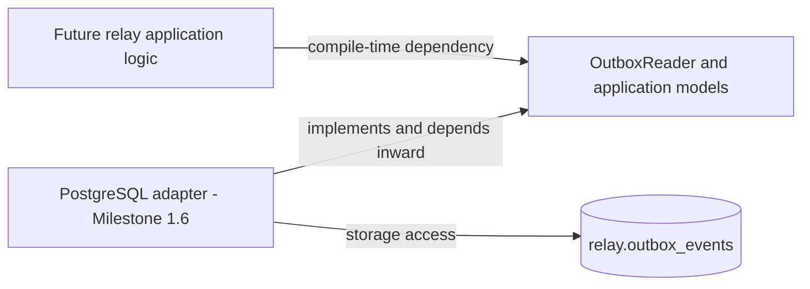
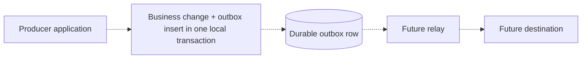

[Português brasileiro](../pt-BR/persistence-abstraction.md) | [README](../../README.md)

# Persistence abstraction — Milestone 1.5

## Purpose and implemented boundary

`src/persistence/` defines application-facing outbox types, classified errors and **one read-only contract**, `OutboxReader`. Future relay logic can depend on these Rust semantics instead of SQL, driver types or a database row. This is deliberately a first boundary, not a complete processing engine: Milestone 1.6 adds a concrete read adapter; the HTTP bootstrap has no database connection, insert, claim, transition or delivery behavior. SQLx 0.8.6 now also backs the read-only PostgreSQL adapter.

The scope is proportional to the unresolved ownership problem. A bounded read is useful and has precise semantics today. Producer append and ID-only lifecycle updates would communicate transactional/concurrency guarantees that the current schema and service cannot yet provide; they are intentionally absent. No generic Repository<T>, giant CRUD interface or empty infrastructure modules are introduced.



The arrows from logic/adapter to the port express dependency direction, not the sequence of runtime calls. At runtime future logic invokes a concrete reader through the contract; that reader accesses storage. Existing HTTP bootstrap is not wired to the port.

## Producer and relay responsibilities



The producer owns the business transaction and inserts the event atomically with its own state change. The relay later reads/delivers durable events. No OutboxWriter is exposed: independently committing append in this standalone service cannot be atomic with another application's transaction, even if both point at PostgreSQL. A future producer library would need integration with the producer's transaction/unit-of-work, rather than pretending a standalone append has that guarantee.

Duplicate IDs are an open producer-side decision. The primary key rejects duplicate identity; treating that as idempotent success would require verifying identical intended content and defining producer semantics. It could instead be a conflict or bug. No blanket idempotency or duplicate-error mapping is decided here, and the read boundary has no speculative Conflict variant.

## Contract: OutboxReader::read_eligible

```rust
fn read_eligible(
    &self,
    request: EligibleRead,
) -> impl Future<Output = Result<Vec<PendingOutboxEvent>, PersistenceError>> + Send;
```

| Aspect | Required semantics |
| --- | --- |
| Input | Explicit DateTime<Utc> cutoff plus positive BatchSize |
| Output | At most limit snapshots pending and available_at <= cutoff at the read snapshot |
| Atomicity | One consistent logical read snapshot; no lifecycle writes or reservations |
| Repeated calls | Side-effect free; may return the same events or changed contents as storage changes |
| Empty success | No eligible events observed in this snapshot; not proof of no backlog |
| Failure | Unavailable, InvalidStoredData or OperationFailed; do not silently skip/fix malformed selected rows |
| Cancellation | Does not authorize mutations or leave claimed ownership |
| No guarantee | Claim/exclusivity, exactly-once delivery, business ordering or stability after the read |

The future adapter must satisfy the bound/cutoff/pending contract and faithfully restore envelopes; the trait signature does not mechanically prove those guarantees. Model/fake tests establish API usability, not adapter conformance. A failing selected record fails the operation, avoiding silent loss. Partial success is not exposed. No pagination, unbounded read, implicit wall clock, ordered=true flag or retry/backoff calculation is provided.

## Models instead of SQL rows

| Type | Responsibility |
| --- | --- |
| BatchSize | Wraps NonZeroUsize; new(0) fails with InvalidBatchSize, get exposes the positive limit |
| EligibleRead | Private UTC cutoff and BatchSize, constructed without consulting clocks |
| PendingOutboxEvent | Validated EventEnvelope plus observed u32 attempt_count and UTC available_at |
| InvalidBatchSize | Small standard-library error for invalid request construction |

PendingOutboxEvent is a snapshot of pending work, not a row mirror, claim token or terminal-history model. It preserves event identity/time, payload and optional metadata without generating anything. Infrastructure metadata remains outside EventEnvelope. No serialization or database decoding derives are added to these types. created_at may be used internally for adapter selection order; last_error and terminal completion/history are not needed in this pending-read view. No unused lifecycle enum or arbitrary strings representing status are added: the returned type specifically represents pending state.

The public constructor wraps an already validated envelope; the adapter must verify the stored lifecycle is pending and its shape is coherent before using it. u32 makes negative attempts unrepresentable. Future PostgreSQL decoding must reject negative/overflowing counters, use checked signed-to-unsigned conversion, and respect the schema's signed INTEGER storage range. The model does not impose database integer widths; future mutations must also check representability. BIGINT schema_version must be checked against 1..u32::MAX before reconstructing NonZeroU32. Invalid event fields, unsupported timestamps/JSON representations and corrupt lifecycle data map to InvalidStoredData, not silent casts or normalization that loses identity.

## Errors and diagnostics

PersistenceErrorKind contains only Unavailable (storage access unavailable), InvalidStoredData (selected data violates/restores incorrectly), and OperationFailed (other failures). Categories express caller-facing meaning, not SQLSTATE, driver strings or a guaranteed retry policy. The future adapter owns detailed classification; callers own response/retry policy. Unknown adapter errors must not be presented as safe to retry merely by matching a category.

PersistenceError preserves an optional `Box<dyn Error + Send + Sync>` through Error::source. This boxes a diagnostic source, not a persistence adapter. Display and Debug show only static classification and whether a source exists; they omit underlying text, credentials and payloads. Source inspection may still reveal sensitive driver details, so logging complete source chains requires redaction. No thiserror dependency, user-supplied public message or string-only loss of diagnostic type is introduced.

## Async and dispatch decision

Use native stable return-position impl Future in the trait with an explicit Send bound; implementations may use async fn. OutboxReader itself is Send + Sync. This supports generic callers and Tokio-spawned Send futures without async-trait or boxed futures. Static dispatch through R: OutboxReader is sufficient for test fakes and the implemented concrete adapter; runtime-swappable adapters are not required. This form is intentionally not dyn-compatible. Introducing runtime dynamic dispatch later would require a deliberate API/boxing design. See [Rust's native async trait guidance](https://blog.rust-lang.org/2023/12/21/async-fn-rpit-in-traits/).

The Send requirement is an API choice with compatibility cost if relaxed/changed later. Static dispatch can increase monomorphized code; it avoids mandatory future boxing and runtime dependency-injection machinery here. This is not a performance claim.

## Claims, lifecycle and delivery: intentionally unresolved

Reading does **not** claim an event. Multiple readers may observe the same pending event; the schema has neither processing nor durable lease ownership. The snapshots must not be used as proof that concurrent workers may deliver safely. Future PostgreSQL ownership capabilities and worker design must settle whether ownership spans a transaction, a short transaction plus another durable mechanism, or lease/recovery columns in a later migration. SQL locking details belong in the adapter, not this contract. No WAL/logical-replication consumption is planned here; this project uses an explicit row lifecycle and its own boundary design.

No complete/reschedule/dead-letter methods are added yet. ID-only updates without ownership/expected-state semantics could acknowledge or overwrite another worker's work. Their input, atomicity, conflict and repeated-call behavior must be specified when that authority is designed. Existing schema semantics remain:

- Successful completion eventually sets processed and processed_at after a destination operation. Publish can succeed and the process can crash before completion commits: later publication may duplicate. No persistence acknowledgement can by itself guarantee exactly once.
- Retry policy belongs to relay logic. A future persistence mutation stores the caller-selected attempt_count, available_at and sanitized last_error, remaining pending; it does not calculate exponential backoff.
- Terminal failure sets dead_letter with processed_at NULL in the same durable state update. A separate DLQ table, replay API and repeated transition guarantees are deferred.

These are future requirements, not methods or side effects implemented now. Reads are side-effect free; mutation idempotency is explicitly undecided rather than falsely guaranteed.

## Bounds, ordering and trade-offs

Future flow is durable backlog → bounded retrieval → bounded in-memory work → destination. BatchSize bounds event count per read, not bytes, backlog growth or total concurrency. Large payloads can still consume memory. No arbitrary numeric maximum is imposed; later caller configuration/resource policy must choose sensible caps, and adapters must convert limits safely rather than allocating the requested maximum eagerly. There are no new environment variables or tuning parameters.

The current schema index can support deterministic availability/creation/ID selection, but this first contract promises no specific order. Concurrent completion and rescheduling may reorder delivery. UUID v7 is not business ordering; aggregate ordering would need explicit capability and trade-offs later.

The abstraction adds types/interface cost that a tiny CRUD service might not need. It hides driver details but risks hiding essential transaction semantics, which is why the read/no-claim guarantee is explicit. Fakes help test generic usage but do not simulate database locking, durability or recovery. Other adapters are possible; database portability is not the goal. Open questions are ownership/recovery boundaries, mutation conflict/idempotency rules, attempt-count update timing, producer duplicate policy, operational bounds and aggregate ordering. Milestone 1.6 owns the PostgreSQL adapter and driver dependency; 1.7 owns repository integration tests. The adapter and the Milestone 1.7 integration suite are implemented.

See [ADR 005](adr/005-separate-persistence-contracts-from-postgresql.md), [test coverage](testing.md), [actual validation](validation-results.md) and [outbox schema](outbox-schema.md).

## PostgreSQL repository — Milestone 1.6 implemented

`src/infrastructure/postgres/` implements the existing `OutboxReader` using an injected `PgPool`. Infrastructure depends inward on persistence and domain; SQL, SQLx, private rows and driver mapping stay in infrastructure. Models own validation/conversion and contain no queries. No duplicate interface, empty layers, new migration or ADR is needed under ADR 005. Native Send futures/static dispatch remain intact. HTTP startup remains independent of PostgreSQL.

See [query, restoration, bounds and errors](postgres-repository.md), [integration test guidance](testing.md) and [executed validation](validation-results.md). SQLx is now an application dependency as well as separate migration tooling. Writes, claims and processing remain deferred; Milestones 1.7 and 1.8 are complete: integration evidence and [failure/transaction semantics](failure-and-transaction-semantics.md). Milestone 1 is closed; later delivery work has not begun.

Milestone 1 is closed. [Failure/transaction semantics](failure-and-transaction-semantics.md) records producer commit uncertainty, invalid-row blocking, cancellation limits and future publish/ack gaps without adding contracts.
