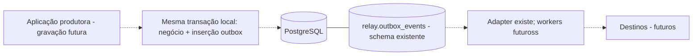
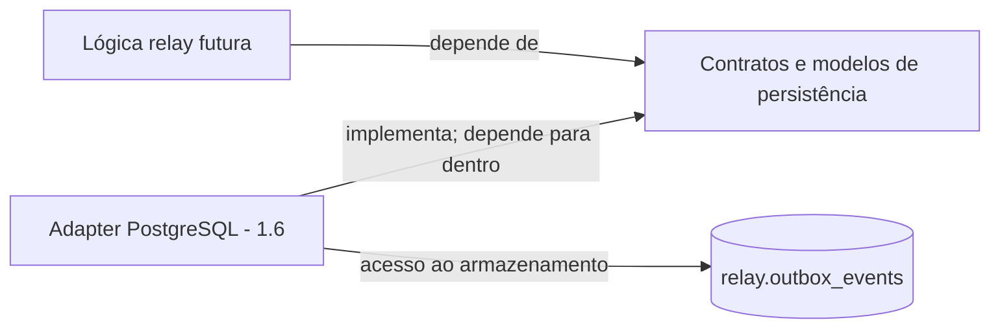

[English](../en/architecture.md) | [README](../../README.pt-BR.md)

# Arquitetura

## Base implementada

`main` → configuração e telemetria → listener TCP → ciclo de vida HTTP da aplicação.
A aplicação aceita uma future de encerramento injetada; os testes usam um socket real com porta efêmera, sem estado global de sinais. Não há lógica de entrega ou armazenamento. O domínio de eventos está em `src/domain/event.rs`; interfaces focadas de persistência agora existem separadamente; sem adapter em runtime ou abstração de broker conectados.

## Envelope canônico de eventos — Marco 1.1 implementado

`domain::event::EventEnvelope` define a fronteira de transporte/armazenamento, com campos privados e métodos de leitura:

| Campo | Representação Rust | Significado |
| --- | --- | --- |
| `id` | `Uuid` | Identidade estável do evento, gerada como UUID v7 |
| `event_type` | `EventType` | String validada, independente de catálogos de eventos de negócio |
| `aggregate_type` | `String` | Tipo genérico do agregado de origem |
| `aggregate_id` | `String` | Identificador genérico; aceita formatos UUID, inteiro, ULID ou externos |
| `schema_version` | `NonZeroU32` | Versão positiva do schema, começando em 1 |
| `occurred_at` | `DateTime<Utc>` | Instante da ocorrência de negócio em UTC, serializado como RFC 3339 |
| `correlation_id` | `Option<Uuid>` | Relaciona operações/eventos associados |
| `causation_id` | `Option<Uuid>` | Identifica o evento ou comando que causou este evento |
| `payload` | `serde_json::Value` | JSON específico do evento |

`EventEnvelope::new(event_type, aggregate_type, aggregate_id, schema_version, payload)` retorna o erro tipado `EventError` para entradas inválidas e gera o ID e o instante UTC atual. Os metadados opcionais começam ausentes; `with_correlation_id` e `with_causation_id` os adicionam. Tipos de evento, tipos de agregado e IDs de agregado vazios ou compostos apenas por espaços são rejeitados; strings não vazias são preservadas sem restrições de formato ou tamanho. A versão zero é rejeitada. `EventType` oferece seu próprio construtor validado.

A restauração via Serde preserva a identidade e o instante originais e aplica a mesma validação. Também permite fornecer instantes históricos ou determinísticos; offsets são normalizados para UTC. O JSON usa os nove nomes de campos acima, com metadados ausentes serializados como `null`. IDs permanecem estáveis após serialização e restauração. UUID v7 oferece características de ordenação temporal, sem ordenação global estrita. Versões de schema descrevem a evolução do payload; não há framework de migração ou compatibilidade. JSON é a fronteira do payload de transporte/armazenamento, não uma exigência de JSON sem tipos na lógica interna de negócio.

As dependências são Serde (derive), serde_json, UUID (v7/serde) e Chrono (clock/serde, features padrão desativadas). O pequeno enum de erros usa a biblioteca padrão em vez de adicionar thiserror. Não há comportamento de persistência ou entrega.

## Decisões e trade-offs do envelope

UUID v7 fornece identidade globalmente única com características temporais úteis, sem ordenação global estrita. Strings de agregado suportam UUIDs, inteiros, ULIDs, IDs externos e outros formatos, ao custo de garantias de formato mais fracas. EventType valida nomes lógicos não vazios sem enum específico de negócio; consistência de nomes continua sendo responsabilidade do produtor. NonZeroU32 impede versão zero, mas não estabelece compatibilidade de schema. DateTime<Utc> padroniza timestamps RFC 3339; precisão do relógio e significado da ocorrência de negócio continuam sendo responsabilidades do produtor.

JSON oferece uma fronteira flexível de transporte/armazenamento, sacrificando tipagem de payload em compilação; código de negócio deve preferir estruturas tipadas quando adequado. IDs opcionais de correlação e causalidade como UUID são simples e consistentes com IDs do relay, mas não representam diretamente trace IDs em string, ULIDs, identificadores de fornecedores ou tokens arbitrários. Este é um trade-off atual explícito e um ponto de revisão futura baseado em evidências de integração; a implementação do envelope permanece inalterada no Marco 1.2.

## Infraestrutura PostgreSQL local — Marco 1.2 implementado

Compose fornece PostgreSQL com partida do workspace condicionada ao healthcheck, acesso em containers por postgres:5432, no loopback do host por 127.0.0.1:5433 e armazenamento físico `.dockerized-postgres/`. A ferramenta SQLx constrói DATABASE_URL; o binário Rust ainda não estabelece conexão ao banco. Readiness Docker difere de readiness da aplicação. Consulte [topologia/setup](docker-and-configuration.md), [decisão PostgreSQL](postgresql.md) e [ADR 002](adr/002-use-postgresql-for-durable-event-storage.md). SQLx CLI gerencia migrações explícitas; persistência e processamento outbox continuam futuros.

## Evolução pretendida (não implementada)

```text
Produtor / Aplicação
        |
        v
   PostgreSQL
 Outbox Transacional
        |
        v
 Reliable Event Relay
        |
        +------> RabbitMQ
        |
        +------> Webhook HTTP
        |
        +------> Redis Streams
```

Um produtor poderia gravar atomicamente a mudança de negócio e o evento outbox na mesma transação do banco. Workers do relay reivindicariam eventos persistidos e publicariam nos destinos. Esta é uma direção conceitual, não o funcionamento atual.

## Questões de engenharia e direção esperada

- Sobrevivência a crashes: registros duráveis e reivindicações recuperáveis devem substituir estado apenas em memória. Janelas de falha antes e depois da publicação precisam de testes explícitos.
- Publicação bem-sucedida, atualização de estado falha: o relay não consegue inferir com segurança se o destino agiu. Repetir pode duplicar o evento.
- Pelo menos uma vez: repetir entregas não confirmadas cria duplicatas. Consumidores precisam de IDs estáveis, deduplicação e aplicação atômica dos efeitos junto ao registro de idempotência.
- Tentativas: separar falhas transitórias e permanentes, usar backoff exponencial limitado com jitter, timeouts e limite de tentativas. Os valores exigem evidência; nenhum está configurado hoje.
- Mensagens problemáticas: isolar eventos inválidos ou esgotados em estado dead-letter, com diagnóstico e replay deliberado.
- Memória: filas limitadas e concorrência finita limitam trabalho em memória; o backlog durável ainda exige retenção e planejamento de capacidade.
- Produtores mais rápidos: pausar reivindicações, limitar admissões ou rejeitar carga deliberadamente; crescimento de filas não se resolve com memória ilimitada. Definir contrapressão em cada fronteira.
- Ordenação: concorrência e tentativas podem reordenar eventos. Sequenciamento por chave pode ser viável, com menor paralelismo e bloqueio por mensagens anteriores. Não há promessa de ordenação global.

## Trade-offs and non-goals

A futura entrega inicialmente mira semântica de pelo menos uma vez, sem entrega exatamente uma vez. Efeitos exatamente uma vez geralmente exigem cooperação e idempotência entre sistemas. Não se promete uma transação atômica envolvendo PostgreSQL e todos os destinos. O health atual não comprova armazenamento durável, conexão com broker ou readiness. Operação em produção, consenso multirregional, vazão ilimitada, ordenação global e filas em memória sem perda não são objetivos iniciais. O scaffold HTTP permite testar o ciclo de vida ao custo de uma pequena dependência de servidor; isso não comprova confiabilidade do relay.

## Roteiro provisório

| Marco | Exploração |
| --- | --- |
| 0 — Fundação | Rust, Docker, configuração, tracing, encerramento, health, testes, documentação bilíngue (implementado) |
| 1 — Modelo durável de eventos | **Fechado: 1.1-1.8 implementados e validados no escopo documentado**; veja [revisão de fechamento](milestone-1-review.md) |
| 2 — Primeiro adaptador | Publicador RabbitMQ, estado de entrega, tentativas, semântica de pelo menos uma vez |
| 3 — Confiabilidade | Backoff exponencial, DLQ, idempotência, recuperação de crashes, mensagens problemáticas |
| 4 — Concorrência | Canais limitados, pools de workers, limites de concorrência, contrapressão, drenagem no encerramento |
| 5 — Múltiplos destinos | Webhooks HTTP, Redis Streams, abstração de roteamento |
| 6 — Observabilidade | Prometheus, readiness, latência de entrega, contadores de tentativas, profundidade do backlog |
| 7 — Cenários de falha e benchmarks | Indisponibilidade do broker, crash de worker, timeouts, recuperação de backlog, medições de vazão/latência e limites documentados |

São marcos de estudo, não lançamentos prometidos. A arquitetura pode mudar quando a implementação indicar uma solução melhor.

## Progresso do Marco 1 (fechado)

- [x] 1.1 Envelope canônico de eventos
- [x] 1.2 PostgreSQL local no Docker
- [x] 1.3 Infraestrutura de migrações
- [x] 1.4 Schema outbox
- [x] 1.5 Abstração de persistência
- [x] 1.6 Repositório PostgreSQL
- [x] 1.7 Testes de integração
- [x] 1.8 Semântica de falhas e transações

## Infraestrutura de migrações — Marco 1.3 concluído

SQLx CLI 0.8.6 executa migrações Docker; SQLx 0.8.6 também executa leituras da aplicação. A migração inicial cria namespace `relay`; Marco 1.4 adiciona tabela outbox por nova migração. SQLx 0.8.6 agora é dependência da aplicação para o adapter de leitura. [Fluxo](database-migrations.md) e [ADR 003](adr/003-use-versioned-sql-migrations.md) definem responsabilidade e limites. Marco 1 fechado; leitura PostgreSQL implementada; processamento posterior permanece planejado.

## Schema outbox — Marco 1.4 concluído

`relay.outbox_events` mapeia envelope canônico inalterado para UUID/TEXT/BIGINT/TIMESTAMPTZ/JSONB com metadados UUID nullable e campos mínimos de ciclo de vida. NonZeroU32 exige BIGINT limitado para preservar intervalo completo. Schema existe; gravações Rust, transações de negócio do produtor, claims e entrega ainda não. Veja [colunas/invariantes/trade-offs](outbox-schema.md) e [ADR 004](adr/004-use-postgresql-transactional-outbox-schema.md).



Produtor grava eventos duráveis com sua mudança de negócio em uma transação do banco; relay entrega esses eventos depois. Conceitualmente: BEGIN → atualizar estado de negócio → inserir relay.outbox_events (...) → COMMIT. Outro banco ou broker remoto está fora da fronteira atômica. Entrega pelo menos uma vez e idempotência são preocupações futuras; tabela sozinha não garante efeitos exatamente uma vez.

## Abstração de persistência — Marco 1.5 concluído

O contrato `OutboxReader` observa snapshots pending elegíveis com corte UTC explícito e BatchSize positivo. PendingOutboxEvent envolve envelope inalterado com tentativas unsigned/disponibilidade UTC. É visão pending, não linha SQL ou claim. Erros classificados preservam fontes com formatação sanitizada. Futures Send nativas e dispatch genérico não adicionam dependências. Runtime continua apenas HTTP.



Setas para PORT significam dependência de compilação, não sequência de chamadas. Chamadores genéricos invocarão implementação pelo contrato; tipos PostgreSQL não entram nessa fronteira. Escrita permanece na transação de negócio do produtor, sem append relay com commit independente. Snapshots não são claims: mutações/propriedade/recuperação estão adiadas, sem afirmar segurança concorrente ou exatamente uma vez. Diagrama produtor/relay acima permanece conceitual para escrita/entrega.

Veja [contratos e questões abertas](persistence-abstraction.md), [ADR 005](adr/005-separate-persistence-contracts-from-postgresql.md) e [testes](testing.md). Marco 1 fechado, incluindo 1.8 [falhas/transações](failure-and-transaction-semantics.md).

## Repositório PostgreSQL — Marco 1.6 implementado

`src/infrastructure/postgres/` implementa `OutboxReader` com `PgPool` injetado. Infraestrutura depende dos contratos de persistência e domínio; SQL, SQLx, linhas privadas e classificação de erros ficam na infraestrutura. Modelos validam/convertem dados sem consultas. ADR 005 permanece suficiente: sem interface duplicada, camadas vazias, nova migração ou ADR. Futures Send nativas e dispatch estático permanecem. Bootstrap HTTP continua independente do banco.

Veja [consulta, restauração, limites e erros](postgres-repository.md), [testes de integração](testing.md) e [validação executada](validation-results.md). SQLx agora também é dependência da aplicação. Escrita, claims e processamento ficam adiados; Marcos 1.7 e 1.8 concluídos: integração e [semântica de falhas/transações](failure-and-transaction-semantics.md). Marco 1 fechado; entrega futura não iniciada.
