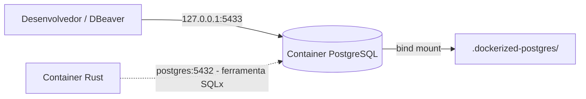

[English](../en/docker-and-configuration.md) | [README](../../README.pt-BR.md)

# Docker e configuração

O Dockerfile é uma imagem de ferramentas de desenvolvimento, não de implantação em produção. Fixa Rust estável 1.95.0 sobre Debian Bookworm, inclui Bash, rustfmt, Clippy, Python 3 e SQLx CLI 0.8.6 e executa como `developer`. A tag de versão é fixa; o digest da imagem base não é, portanto revisões upstream ainda podem mudar pacotes de sistema. Compose usa um processo init e montagem do código do host. `sleep infinity` mantém o workspace utilizável antes do download das dependências.

```bash
cp .env.example .env
# No Linux: ajuste no .env os valores LOCAL_UID=$(id -u) e LOCAL_GID=$(id -g).
docker compose up -d --build
docker compose exec app bash
# Dentro do shell:
cargo fetch --locked
cargo build --locked
cargo test --locked
cargo fmt
cargo clippy --locked --all-targets --all-features -- -D warnings
cargo run --locked
```

Use Ctrl-C para parar a aplicação em primeiro plano e `docker compose down` para parar o ambiente. Mudanças no código exigem nova execução; mudanças de UID/GID ou Dockerfile exigem reconstrução da imagem. No Linux, a raiz montada precisa permitir escrita pelo UID/GID configurado. Não execute os primeiros comandos Cargo como root. IDs numéricos padrão são 1000; escolha ID sem privilégios. IDs existentes na imagem base podem impedir a criação de usuário/grupo: escolha IDs compatíveis ou adapte a criação para seu ambiente. Docker Desktop traduz montagens macOS/Windows de maneira diferente; o comportamento de propriedade Linux não foi testado nesses sistemas. No Windows, use um shell compatível com os comandos (por exemplo WSL). Bash está disponível via `docker compose exec app bash`.

| Variável | Padrão | Uso |
| --- | --- | --- |
| APP_ENV | development | Rótulo nos logs de partida; não muda entrega |
| RUST_LOG | info | Filtro tracing; filtros inválidos impedem partida |
| HTTP_ADDR | 0.0.0.0:8080 | IP e porta; endereços inválidos impedem partida |
| HOST_HTTP_PORT | 8080 | Porta loopback do host no Compose |
| LOCAL_UID / LOCAL_GID | 1000 / 1000 | Identidade developer durante build |
| CARGO_HOME | /app/.cargo-cache | Cache de fontes/downloads Cargo no container |
| CARGO_TARGET_DIR | /app/target | Artefatos compilados no container |

As três primeiras são configurações da aplicação. As demais pertencem às ferramentas de desenvolvimento. Não há strings de conexão obrigatórias. O wrapper SQLx constrói DATABASE_URL com configurações PostgreSQL injetadas pelo Compose; o binário Rust não a consome. URLs de RabbitMQ/Redis, concorrência de workers, tentativas e batches continuam planejados.

O binário carrega `.env` do diretório de trabalho ou ancestrais com dotenvy; variáveis já existentes no processo têm precedência. Compose lê separadamente o `.env` da raiz para interpolação (portas/IDs); não injeta todos os valores no container. A montagem do código expõe `.env` para leitura pelo binário em execução. Para sobrescrever explicitamente: `docker compose exec -e RUST_LOG=debug app cargo run --locked`. A ausência de `.env` é válida; `.env` malformado, APP_ENV vazio, HTTP_ADDR ou RUST_LOG inválidos e sockets ocupados causam falha.

Mantenha `.env` e credenciais de cache fora do Git e do contexto de build Docker. Não coloque segredos em `.env.example`. A porta é publicada apenas no loopback do host; mudar HTTP_ADDR para loopback do container impede acesso pelo host. Mantenha 8080 no container ou ajuste também a porta interna no Compose. `/health` indica apenas liveness, sem verificações de readiness das dependências.

## Reconstruindo o ambiente local

```bash
git clone https://github.com/juniocr26/rust-event-relay.git
cd rust-event-relay
cp .env.example .env
# Linux: alinhe LOCAL_UID e LOCAL_GID antes do build.
docker compose up -d --build --wait --wait-timeout 120
docker compose ps
docker compose logs postgres
docker compose exec postgres sh -c 'pg_isready -h 127.0.0.1 -p 5432 -U "$POSTGRES_USER" -d "$POSTGRES_DB"'
docker compose exec postgres sh -c 'PGPASSWORD="$POSTGRES_PASSWORD" psql -h postgres -p 5432 -U "$POSTGRES_USER" -d "$POSTGRES_DB" -c "SELECT 1;"'
docker compose exec app sqlx migrate run
docker compose exec app cargo fetch --locked
docker compose exec app cargo build --locked
docker compose exec app cargo run --locked
```

Compose cria uma rede do projeto. `app` resolve `postgres` pelo DNS do Docker. PostgreSQL escuta internamente em 5432; apenas o mapeamento no host usa 5433, evitando a porta 5432 do outro projeto. `app` aguarda o healthcheck sem sleeps fixos. O workspace executa `sleep infinity` até você chamar Cargo; a aplicação ainda não exige conexão ao banco. A dependência de partida não é readiness da aplicação em execução.



## Configuração do banco e clientes

| Variável | Padrão apenas ilustrativo | Uso |
| --- | --- | --- |
| POSTGRES_DB | reliable_event_relay | Banco inicializado em cluster vazio |
| POSTGRES_USER | change_me | Superusuário inicial |
| POSTGRES_PASSWORD | change_me | Placeholder de senha apenas local |
| POSTGRES_HOST | postgres | Hostname interno Docker |
| POSTGRES_PORT | 5432 | Porta interna Docker |
| POSTGRES_HOST_PORT | 5433 | Publicação loopback no host |

Defina credenciais locais no `.env` ignorado antes da primeira inicialização. Compose injeta DB/USER/PASSWORD no postgres e os cinco componentes internos no app. O wrapper Python SQLx aplica percent-encoding a usuário/senha/banco e constrói DATABASE_URL por chamada. Não exige encoding manual ou Cargo no host. A URL vai ao processo SQLx, sem ser impressa ou armazenada em código. DATABASE_URL do host não substitui o wrapper. Comandos normais usam postgres:5432; a opção explícita SQLx `--database-url` substitui a conexão conforme comportamento do CLI, portanto use-a apenas deliberadamente. O binário Rust permanece independente de banco.

POSTGRES_DB/USER/PASSWORD são principalmente variáveis de inicialização: **ambiente Docker != usuários/bancos já criados no PostgreSQL**. Por exemplo, mudar first_user para second_user no `.env` altera o ambiente, mas mantém first_user no cluster persistido. Autenticação pode falhar com servidor saudável. Mudar .env não renomeia usuários, redefine senhas nem cria novo banco em cluster existente. Veja [explicação e recuperação](postgresql.md#inicialização-e-reset-deliberado).

DBeaver usa **127.0.0.1**, porta **5433**, banco/usuário/senha de POSTGRES_DB/USER/PASSWORD, correspondendo ao estado realmente inicializado. IPv4 explícito evita ambiguidade IPv6 de localhost. Host usa 127.0.0.1:5433; containers usam postgres:5432. PostgreSQL permanece publicado apenas no loopback, nunca 0.0.0.0.

```bash
# Variáveis expandem no container, não no shell do host:
docker compose exec postgres sh -c 'psql -U "$POSTGRES_USER" -d "$POSTGRES_DB"'
# psql no host: informe banco/usuário configurados e digite a senha solicitada:
psql -h 127.0.0.1 -p 5433 -U change_me -d reliable_event_relay -W
```

Valores do host acima são placeholders. `docker compose exec postgres psql -U "$POSTGRES_USER"` diretamente expande variáveis do host; `sh -c` com aspas simples usa ambiente do container. Socket local não necessariamente valida senha; use consulta TCP autenticada em [testes](testing.md).

## Estado físico e encerramento

| Diretório no host | Conteúdo | Responsabilidade |
| --- | --- | --- |
| `.cargo-cache/` | Dependências Cargo baixadas | Gerado/ignorado; reconstruir com cargo fetch --locked |
| `target/` | Artefatos Rust | Gerado/ignorado; reconstruir com cargo build --locked |
| `.dockerized-postgres/` | Dados do cluster em 18/docker/ | Local/ignorado; estado persistente do banco |
| `migrations/` | Histórico SQL do schema | Código-fonte; deve ser commitado |

Os três primeiros são estado gerado/local; migrações são código-fonte. Dados PostgreSQL não são reconstruídos apenas compilando código. Up, down, build e recriação preservam cluster; nenhum entrypoint o reinicializa silenciosamente. Histórico de migração nunca fica no diretório de dados. SQLx CLI executa comandos explícitos, não mudanças automáticas de startup. Alterações DBeaver não substituem migrações como autoridade do schema.

## Reset destrutivo deliberado

**AVISO: isto exclui permanentemente o estado do banco PostgreSQL local.** Faça backup do necessário e decida explicitamente descartar o cluster antes de executar comandos manuais na raiz. Não há helper de exclusão automática.

```bash
docker compose down
rm -rf .dockerized-postgres/
docker compose up -d --build --wait --wait-timeout 120
docker compose exec app sqlx migrate run
```

Reset inicializa usuários/banco a partir do .env atual e exclui todos os bancos e dados anteriores. **Reset do banco != rollback de migração**: `docker compose exec app sqlx migrate revert` executa a última down controlada e preserva outro estado do cluster. Não redefine credenciais.

## Solução de problemas PostgreSQL

- Examine `docker compose ps` e `docker compose logs postgres`; pg_isready verifica aceitação, não autenticação.
- Credenciais mudadas após inicialização: use credenciais autorizadas existentes, administração SQL deliberada ou reset explicitamente destrutivo acima. Nunca exclua dados para corrigir startup silenciosamente.
- Host 5433 ocupado: mude POSTGRES_HOST_PORT; mantenha 5432 interna.
- Permissões/montagens somente leitura podem impedir inicialização. Não torne arquivos graváveis por todos. Propriedade postgres no Linux difere de LOCAL_UID/GID.
- Incompatibilidade de versão principal exige upgrade suportado ou backup/restauração, não exclusão automática.
- Compose condiciona partida ao health; falhas de conexão em migrações posteriores ainda falham claramente. Testes Rust permanecem independentes de banco.

Veja [PostgreSQL](postgresql.md), [migrações](database-migrations.md), [testes](testing.md) e [validação](validation-results.md).

## Diagnóstico de autenticação somente leitura

```bash
./scripts/check-postgres.sh
docker compose exec -T app sqlx migrate info
```

[check-postgres.sh](../../scripts/check-postgres.sh) verifica health, publicação IPv4 loopback, Compose/.env atual versus configurações dos containers, identidade autenticada e histórico existente. Não imprime usuário ou senha configurados. Falha com saída não-zero em divergência de configuração/autenticação, nunca altera usuários, cria metadados, aplica migrações ou reinicializa dados. Usa Python no container app; a sondagem TCP do host usa nc ou Python 3 e informa explicitamente quando pula por ausência de ambos. SQLx é validado separadamente.

Compose fornece POSTGRES_HOST/PORT ao postgres para diagnósticos de cliente, sem alterar escuta do servidor. Host/DBeaver usa 127.0.0.1:5433 e POSTGRES_DB/USER/PASSWORD atualmente inicializados; containers usam postgres:5432. A interface DBeaver não foi testada.

Mudar `.env` não atualiza cluster inicializado. Usuário ausente pode gerar erro TCP genérico de senha. Inspecione detalhes do servidor/usuários para distinguir de usuário existente com senha incorreta. A correção real verificou ausência de dados antes do reset destrutivo explicitamente autorizado e executou migrações existentes. Startup/shutdown Compose normal continua não destrutivo. Reset exclui todo estado; rollback de migração não corrige credenciais.

Configuração Compose bruta, dumps de ambiente e ajuda SQLx podem revelar segredos; use parser que informe apenas campos não sensíveis/comparações e remova credenciais dos logs compartilhados. Veja [correção PostgreSQL](postgresql.md#correção-de-autenticação-no-cluster-local-real) e [resultados reais](validation-results.md#correção-de-autenticação-postgresql-local).

## Configuração da abstração — Marco 1.5

Sem novas variáveis, pools ou tuning de persistência. Novos testes Rust não carregam .env nem conectam PostgreSQL. Setup Docker PostgreSQL/SQLx continua como ferramenta de schema; binário segue sem adapter de banco. Limites operacionais de lote, intervalo de polling, delays e máximo de tentativas pertencem à configuração futura do chamador/worker. Veja [decisões de persistência](persistence-abstraction.md).
