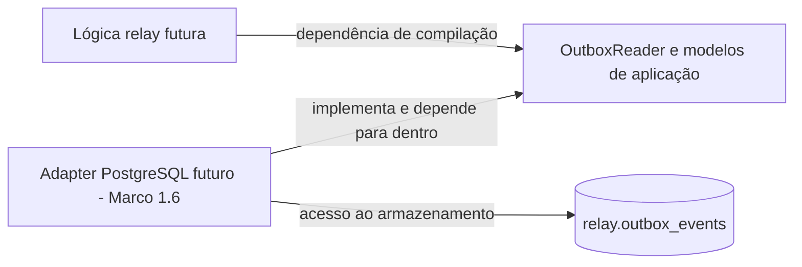
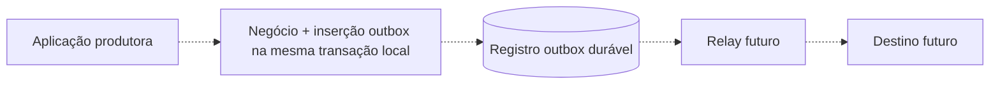

[English](../en/persistence-abstraction.md) | [README](../../README.pt-BR.md)

# Abstração de persistência — Marco 1.5

## Objetivo e fronteira implementada

`src/persistence/` define tipos voltados à aplicação, erros classificados e **um contrato somente leitura**, `OutboxReader`. Lógica relay futura pode depender dessas semânticas Rust em vez de SQL, driver ou linhas do banco. É uma primeira fronteira deliberada, não engine completa: Marco 1.6 adiciona adapter concreto somente leitura; bootstrap HTTP continua sem conexão com banco, inserção, claim, transição ou entrega. SQLx agora também é dependência da aplicação.

O escopo é proporcional ao problema de propriedade ainda aberto. Leitura limitada é útil e tem semântica precisa hoje. Append do produtor e updates de ciclo apenas por ID comunicariam garantias transacionais/concorrentes que serviço/schema ainda não fornecem; ficam ausentes. Sem Repository<T> genérico, interface CRUD gigante ou módulos vazios.



Setas da lógica/adapter para contrato representam dependência, não sequência de chamadas. Em runtime a lógica invocará reader concreto pelo contrato; reader acessará armazenamento. Bootstrap HTTP existente não foi conectado ao contrato.

## Responsabilidade do produtor e relay



Produtor controla transação de negócio e insere evento atomicamente com sua mudança de estado. Relay lê/entrega depois. Sem OutboxWriter: append com commit independente neste serviço não é atômico com transação de outra aplicação, mesmo usando PostgreSQL. Biblioteca futura de produtor precisaria integrar a transação/unit-of-work do produtor, sem atribuir essa garantia a append isolado.

IDs duplicados continuam decisão do produtor. PK rejeita identidade duplicada; tratar como sucesso idempotente exigiria verificar conteúdo pretendido igual e definir semântica. Pode ser conflito ou bug. Nenhuma política genérica de idempotência/mapeamento foi definida; a fronteira de leitura não tem Conflict especulativo.

## Contrato: OutboxReader::read_eligible

```rust
fn read_eligible(
    &self,
    request: EligibleRead,
) -> impl Future<Output = Result<Vec<PendingOutboxEvent>, PersistenceError>> + Send;
```

| Aspecto | Semântica exigida |
| --- | --- |
| Entrada | Corte DateTime<Utc> explícito e BatchSize positivo |
| Saída | No máximo limit snapshots pending com available_at <= corte no snapshot |
| Atomicidade | Um snapshot lógico consistente; sem alterar ciclo ou reservar trabalho |
| Repetição | Sem efeitos; pode retornar eventos iguais ou conteúdo mudado conforme banco muda |
| Sucesso vazio | Nenhum elegível observado; não prova ausência de backlog |
| Falha | Unavailable, InvalidStoredData ou OperationFailed; não ignorar/corrigir registros selecionados inválidos |
| Cancelamento | Não autoriza mutações ou deixa propriedade de claim |
| Sem garantia | Exclusividade/claim, exatamente uma vez, ordem de negócio ou estabilidade após leitura |

Adapter futuro deve respeitar limite/corte/pending e restaurar envelopes fielmente; assinatura não prova garantias mecanicamente. Testes de modelo/fake demonstram uso da API, não conformidade de adapter. Registro selecionado inválido faz a operação falhar, evitando perda silenciosa. Sem sucesso parcial, paginação, leitura ilimitada, relógio implícito, ordered=true ou cálculo de backoff.

## Modelos em vez de linhas SQL

| Tipo | Responsabilidade |
| --- | --- |
| BatchSize | Encapsula NonZeroUsize; new(0) falha com InvalidBatchSize e get fornece limite positivo |
| EligibleRead | Corte UTC e BatchSize privados, sem consultar relógio |
| PendingOutboxEvent | EventEnvelope validado, attempt_count u32 observado e available_at UTC |
| InvalidBatchSize | Erro pequeno da biblioteca padrão para requisição inválida |

PendingOutboxEvent é snapshot pending, não espelho de linha, token de claim ou histórico terminal. Preserva identidade/tempo, payload e metadados opcionais sem gerar valores. Infraestrutura fica fora de EventEnvelope. Sem derives de serialização/decoding de banco. created_at pode ordenar internamente no adapter; last_error e histórico/conclusão terminal não são necessários nessa visão pending. Sem enum de ciclo sem uso ou status em strings arbitrárias: tipo retornado representa especificamente pending.

Construtor público envolve envelope validado; adapter deve verificar pending/formato coerente antes de usá-lo. u32 impede tentativas negativas. Decoding PostgreSQL futuro deve rejeitar negativos/overflow, converter assinado para unsigned com verificação e respeitar intervalo INTEGER assinado do schema. Modelo não impõe largura de inteiro do banco; mutações futuras também precisam verificar representabilidade. schema_version BIGINT exige verificar 1..u32::MAX antes de reconstruir NonZeroU32. Campos inválidos, representações de tempo/JSON não suportadas e ciclo corrompido viram InvalidStoredData, sem casts silenciosos ou normalização que perde identidade.

## Erros e diagnóstico

PersistenceErrorKind contém apenas Unavailable (acesso indisponível), InvalidStoredData (dados selecionados violam/não restauram modelo) e OperationFailed (outras falhas). Categorias expressam significado para chamador, não SQLSTATE, strings do driver ou política garantida de retry. Adapter classifica detalhes; chamador decide resposta/retry. Erros desconhecidos não viram seguros de repetir só pela categoria.

PersistenceError preserva fonte opcional `Box<dyn Error + Send + Sync>` em Error::source. Box é da fonte diagnóstica, não do adapter. Display/Debug mostram apenas classificação estática e presença de fonte; omitem texto original, credenciais e payload. Inspecionar fonte ainda pode revelar detalhes sensíveis; logging da cadeia exige remoção de segredos. Sem thiserror, mensagem pública livre ou perda de tipo ao converter tudo para string.

## Async e dispatch

Usa impl Future nativo estável em retorno de trait com Send explícito; implementações podem usar async fn. OutboxReader é Send + Sync. Permite chamadores genéricos e futures Send em Tokio sem async-trait ou future boxed. Dispatch estático R: OutboxReader basta para fakes e adapter implementado; não exige troca em runtime. Essa forma deliberadamente não suporta dyn. Dispatch dinâmico futuro exigirá desenho explícito de API/boxing. Veja [orientação Rust sobre traits async](https://blog.rust-lang.org/2023/12/21/async-fn-rpit-in-traits/).

Send é decisão de API com custo de compatibilidade se mudar depois. Dispatch estático pode aumentar código monomorfizado; evita boxing obrigatório e infraestrutura de injeção dinâmica aqui. Sem afirmação de desempenho.

## Claims, ciclo e entrega: deliberadamente abertos

Ler **não** reivindica evento. Vários readers podem observar mesmo pending; schema não tem processing ou lease durável. Snapshot não comprova segurança de workers concorrentes. Adapter PostgreSQL e workers devem decidir se propriedade dura uma transação, transação curta com outro mecanismo ou lease/recuperação por migração futura. Detalhes SQL de locking pertencem ao adapter. Sem consumo WAL/replicação lógica; projeto usa ciclo explícito em linhas e fronteira própria.

Sem métodos complete/reschedule/dead-letter por enquanto. Updates apenas por ID sem propriedade/estado esperado poderiam confirmar/sobrescrever trabalho de outro worker. Entradas, atomicidade, conflitos e repetição serão especificados ao definir autoridade. Semântica existente do schema:

- Conclusão futura grava processed/processed_at após operação de destino. Publicação pode funcionar e processo cair antes do commit de conclusão: nova publicação pode duplicar. Persistência sozinha não garante exatamente uma vez.
- Política de retry pertence à lógica relay. Mutação futura armazena attempt_count, available_at e last_error sanitizado escolhidos pelo chamador, mantendo pending; não calcula backoff exponencial.
- Falha terminal grava dead_letter e processed_at NULL na mesma atualização durável. Tabela DLQ separada, replay e garantias de transição repetida ficam para depois.

São requisitos futuros, não métodos/efeitos implementados. Leitura não tem efeitos; idempotência de mutações está explicitamente aberta.

## Limites, ordem e trade-offs

Fluxo futuro: backlog durável → leitura limitada → trabalho em memória limitado → destino. BatchSize limita quantidade por leitura, não bytes, crescimento do backlog ou concorrência total. Payloads grandes ainda consomem memória. Sem máximo arbitrário; configuração/política futura escolhe limites operacionais e adapter converte com segurança sem alocar o máximo solicitado antecipadamente. Sem variáveis de ambiente ou tuning novos.

Índice atual pode permitir seleção determinística por disponibilidade/criação/ID, mas contrato não promete ordem específica. Conclusão concorrente e retries podem reordenar entrega. UUID v7 não ordena negócio; ordem por agregado exige capacidade/trade-offs explícitos depois.

Abstração adiciona tipos/interface desnecessários em CRUD pequeno. Esconde driver, mas pode esconder semântica transacional essencial, justificando contrato explícito de leitura/sem claim. Fakes testam uso genérico, sem simular locks, durabilidade ou recuperação. Outros adapters são possíveis; portabilidade não é objetivo. Questões abertas: propriedade/recuperação, conflitos/idempotência de mutações, momento de atualizar tentativas, duplicatas do produtor, limites operacionais e ordem por agregado. Marco 1.6 controla adapter/driver PostgreSQL; 1.7 controla testes de integração. Adapter e suíte de integração do Marco 1.7 implementados.

Veja [ADR 005](adr/005-separate-persistence-contracts-from-postgresql.md), [testes](testing.md), [validação real](validation-results.md) e [schema outbox](outbox-schema.md).

## Repositório PostgreSQL — Marco 1.6 implementado

`src/infrastructure/postgres/` implementa `OutboxReader` com `PgPool` injetado. Infraestrutura depende dos contratos de persistência e domínio; SQL, SQLx, linhas privadas e classificação de erros ficam na infraestrutura. Modelos validam/convertem dados sem consultas. ADR 005 permanece suficiente: sem interface duplicada, camadas vazias, nova migração ou ADR. Futures Send nativas e dispatch estático permanecem. Bootstrap HTTP continua independente do banco.

Veja [consulta, restauração, limites e erros](postgres-repository.md), [testes de integração](testing.md) e [validação executada](validation-results.md). SQLx agora também é dependência da aplicação. Escrita, claims e processamento ficam adiados; Marcos 1.7 e 1.8 concluídos: integração e [semântica de falhas/transações](failure-and-transaction-semantics.md). Marco 1 fechado; entrega futura não iniciada.

Marco 1 fechado. [Semântica de falhas/transações](failure-and-transaction-semantics.md) registra COMMIT incerto do produtor, bloqueio por dados inválidos, limites de cancelamento e janelas futuras publicação/confirmação, sem novos contratos.
